# MelisCms (React back-office) — Functional & Technical Documentation (for AI)

> **What this is.** MelisCms is the **back-office where you build and run your websites** on the
> Melis platform. In the new **React back-office** (`/melis-react`) it ships a **single
> multi-brick bundle** that provides **9 tools**: the **CMS page editor** (a *sidebar host* — the
> site page tree in the left sidebar + a tabbed page editor) and **8 side tools** (Sites,
> Templates, Front-office Languages, Platforms IDs, Styles, 301 Redirects, Mini-Templates, Menu
> manager). The tools are **native full-React** (real React pages calling `/melis/react-api/…`),
> except the page editor's **Edition tab**, which is the legacy drag-and-drop editor loaded in an
> **iframe**. For the underlying data model, services and the page-lifecycle events (which all
> stay server-side), see the [legacy doc](./MelisCms.md); this doc does not repeat them.
>
> **How this document is organised — two clearly separated parts:**
> - **[Part A — Functional Guide](#part-a--functional-guide)** — for everyday users (and the chat
>   assistant) using the React back-office. Plain language.
> - **[Part B — Technical Reference](#part-b--technical-reference)** — for developers and AI
>   building inside the React UI, with code (brick manifest, endpoints, capabilities).
>
> **Audience**: consumed by the **MelisAI** MCP. **Status**: reviewed 2026-08-19.

---

## 0. Where this lives in the React back-office — read this first

This is the map an AI needs before anything else.

### 0.1 One bundle, nine bricks

MelisCms ships **one** brick bundle (`public/ui-react/brick.js`) whose manifest declares a
`bricks: [...]` array — **nine** bricks, each self-registering under its own id in `brick.tsx`:

| Brick id | Route | forwardKey | melisKey | Kind |
|---|---|---|---|---|
| `cms` | `/melis-cms/page` | `null` | `null` | **Page editor** (sidebar host; Component + Sidebar) |
| `cms-sites` | `/melis-cms/sites` | `MelisCms/Sites` | `meliscms_tool_sites` | native React (list + editor + wizard) |
| `cms-templates` | `/melis-cms/templates` | `MelisCms/ToolTemplate` | `meliscms_tool_templates` | native React (list + form; Old = legacy iframe) |
| `cms-languages` | `/melis-cms/languages` | `MelisCms/Language` | `meliscms_tool_language` | native React |
| `cms-platform-ids` | `/melis-cms/platform-ids` | `MelisCms/Platform` | `meliscms_tool_platform_ids` | native React |
| `cms-styles` | `/melis-cms/styles` | `MelisCms/ToolStyle` | `meliscms_tool_styles` | native React |
| `cms-site-301` | `/melis-cms/site-301` | `MelisCms/SiteRedirect` | `meliscms_tool_site_301` | native React |
| `cms-mini-templates` | `/melis-cms/mini-templates` | `MelisCms/MiniTemplateManager` | `meliscms_mini_template_manager_tool` | native React |
| `cms-menu-manager` | `/melis-cms/menu-manager` | `MelisCms/MiniTemplateMenuManager` | `meliscms_mini_template_menu_manager_tool` | native React |

The `route` in the manifest is the real mount URL for the page editor (which has **no** menu
`forwardKey`); for the other 8, the real mount is the **tree route** derived from `forwardKey`
(which happens to equal the manifest `route` here). All bricks appear **only if MelisCms is
active** (brick discovery via `GET /melis/react-api/react-modules`).

### 0.2 The page editor is a **sidebar host**

The `cms` brick registers **two** things: a routed `Component` (`CmsPage`, the tabbed editor in the
content area) **and** a `Sidebar` (`CmsSidebar` → `PageTree`, the site page tree in the left
sidebar). The section stays visible in the left menu as a **sidebar host** (`meliscms_toolstree_section`,
gated by `canAccess('meliscms_page')`) so the page tree is reachable even for a user who has *only*
page rights and no site-tool — see `melisReactSidebarHostSections` in `react.capabilities.php`
(§B4) and the memory note *react-cms-section-page-only-rights*.

### 0.3 The page editor tabs — native React vs the Edition iframe

The editor's chrome (title, action buttons, tab bar) is **native React**, assembled from a
server-merged **structure** (`GET /cms-page/structure` → tabs + buttons + header). Tab **content**:
- **Edition** — the **legacy drag-and-drop editor in an iframe** (`/melis/react-tool-page?key=meliscms_page`).
- **Properties / SEO / Languages** — **native React** (Properties/SEO are controlled forms; one
  global Save/Publish writes them together via the legacy endpoints).
- **Historic / Page Analytics / Scripts / Open Graph / Link Checker / Google Analytics / Versioning
  / Comments** — **modular tabs contributed by other modules** through the extension seam
  `window.__melisRegisterPageTab(key, Component)` (see §B2).

### 0.4 Where the code lives

| Concern | Location |
|---|---|
| Brick source (all 9 tools) | `vendor/melisplatform/melis-cms/ui-react/src/` |
| Built bundle (committed) | `vendor/melisplatform/melis-cms/public/ui-react/brick.js` + `brick.manifest.json` |
| react-api routes + controllers | this module (`config/react-api.php` + `src/Controller/MelisReactApi*Controller.php`) |
| Capabilities | this module (`config/react.capabilities.php`) |
| Host shell + iframe tool mechanism | `melis-core` (React base) + `MelisReactOverride` |

> **In short:** MelisCms in React = the **page editor sidebar host** (tree + tabbed editor, with
> the drag-drop Edition in an iframe) **plus 8 native React side tools**, all in one brick bundle.
> Business logic stays server-side; React = presentation + API calls. Trio note: the CMS data model
> is owned by **MelisEngine**, rendered by **MelisFront** — see [MelisCms.md](./MelisCms.md).

---
---

# PART A — Functional Guide

## A1. What you can do with MelisCms in the new back-office

- **Build & organise pages** — see all your sites and their pages in a **page tree**, open a page
  to edit it, and add / duplicate / move / delete pages.
- **Put content on a page** — edit it on a **live preview** with drag-and-drop content blocks
  (plugins), across **Properties / Edition / SEO / Languages** tabs, then **Save** and **Publish**.
- **Manage sites** — create a website with a **5-step wizard**, and edit a site's Properties,
  Module loading, Domains, Languages, Site config, Translations (and Scripts).
- **Manage the CMS globals** — Templates (page layouts), Styles (CSS), Front-office Languages,
  Platforms IDs (ID ranges per environment), 301 Redirects, Mini-Templates and the Menu manager.

## A2. Finding it in /melis-react

**Where:** left sidebar → **MelisCms**. The section shows the **PAGE TREE** panel plus a **Site
Tools** group.

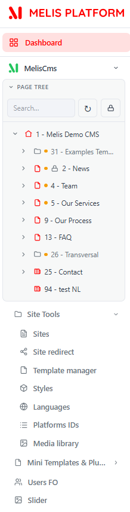
*The MelisCms section in the React sidebar — the PAGE TREE panel (site pages) and the Site Tools group (Sites, Site redirect, Template manager, Styles, Languages, Platforms IDs, Media library, Mini Templates & Plugins, Users FO, Slider). Modules add their own entries here.*

## A3. Key words explained

- **Site** — a website (name, domains, languages, active modules).
- **Page** — one web page; pages live in a **tree** under a site (a page can also be a *folder* or
  the *site root*).
- **Draft vs Published** — you edit the **draft** (Save); visitors only see the **Published**
  version (Publish). *Erase draft* reverts to the published version.
- **Template** — a page's **layout**; **Style** — a CSS stylesheet attached to a page.
- **Plugin / content block** — a reusable block you drop onto a page (text, image, menu, news,
  slider…). **Mini-template** — a pre-built block editors can reuse.
- **New / Old** — every side tool carries a toggle: **New** = React UI, **Old** = the classic tool
  in an iframe (`/melis/react-tool-page?key=<melisKey>`).

> For the domain glossary and the data model, see the [legacy doc](./MelisCms.md).

---

## A4. The page tree — find and organise pages (left sidebar)

**What it's for:** the page tree is the map of your sites and every page inside them. It shows in
the **left sidebar** (it is the `cms` brick's *Sidebar* panel), so it stays visible while you work.

**Where:** sidebar → **MelisCms → PAGE TREE**.

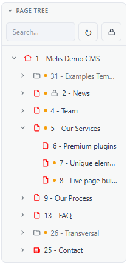
*The React page tree — each site with its pages; a red dot = draft, a lock = locked by another user, the home icon = site root. Search a page, expand nodes, and click a page to open it in the editor.*

**What you can do here:**

- **Open a page** — click it; it opens as a top tab in the editor.
- **Search** — type a name; the server finds pages not yet loaded and expands the tree to them.
- **Right-click actions** on a node — add a child page, see details, duplicate, delete, and more.

  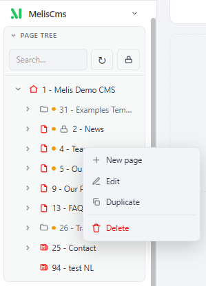
  *The actions available on a page node in the React tree.*

  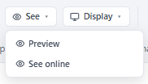
  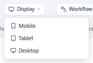
  *Viewing a page's details from the tree — the "See" (Preview / See online) and "Display" menus.*

- **Duplicate** a page or a whole branch.

  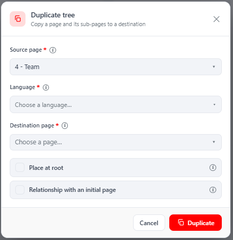
  *Duplicate a page or an entire sub-tree (the React "Duplicate page tree" modal).*

**Tip:** move a page by **drag-and-drop** in the tree (server-side rights decide what you may
move). Deleting a page also removes its content and SEO — duplicate first if unsure.

---

## A5. The page editor — put content on a page

**What it's for:** the editor builds a page's content and settings. It has a **native React chrome**
(page title + status, action buttons, tab bar) around the tab content.

**Where:** open a page from the tree (§A4), or deep-link `/melis-cms/page/:idPage`.

The tabs (native ones first, then any contributed by other modules): **Edition · Properties · SEO ·
Languages · Historic · Page Analytics · Scripts · Open Graph · Link Checker · Google Analytics ·
Versioning · Comments**. The action buttons: **New page · Duplicate · Erase draft · Delete page ·
See · Display · Save · Publish** (plus a Publish/Online status switch, and modular buttons like
**Workflow**).

### A5.1 Properties tab (native React)

**What you set:** the page **name**, **type** (Page / Folder / Site…), **template** (layout),
**language** (locked after creation), **menu display**, **style** and **taxonomy** keywords.

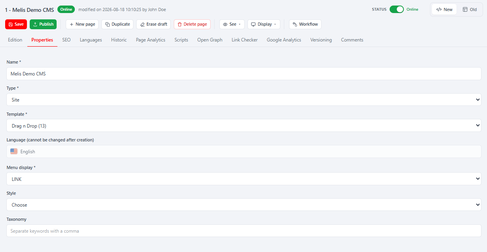
*The React Properties tab — name, type, template, language, menu display, style, taxonomy; the top bar shows the status switch, Save/Publish, the tab bar and the New/Old toggle.*

### A5.2 Edition tab (legacy drag-and-drop in an iframe)

**What it's for:** fill the page. The page renders live and you **drag content blocks (plugins)**
into the template's zones. This tab is the **legacy editor loaded in an iframe** inside the React
chrome — the drag-drop, plugin menu, mini-template manager and rich-text editors are the same as
in the classic back-office (their content is auto-saved into the PHP session and written when you
Save/Publish).

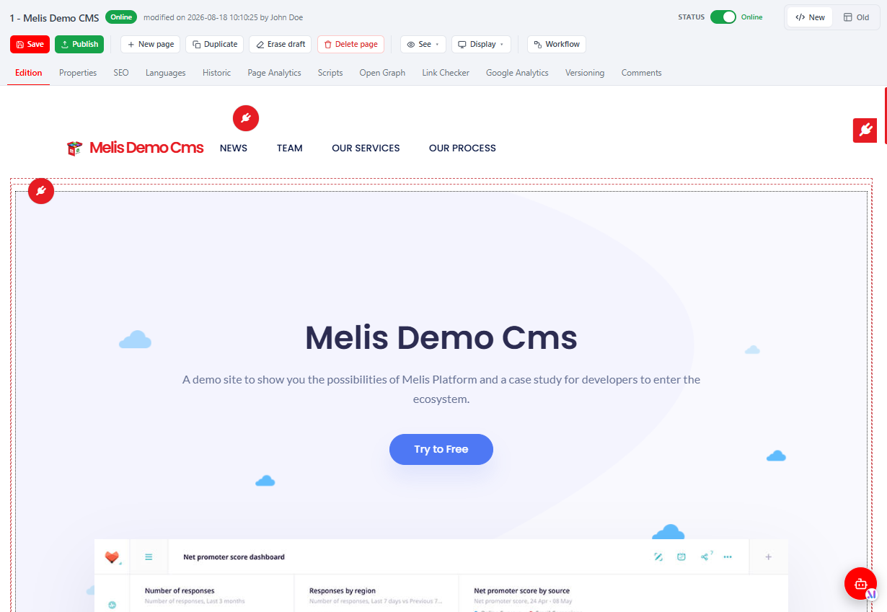
*The Edition tab — the live page with the drag-and-drop overlay, inside the React editor chrome.*

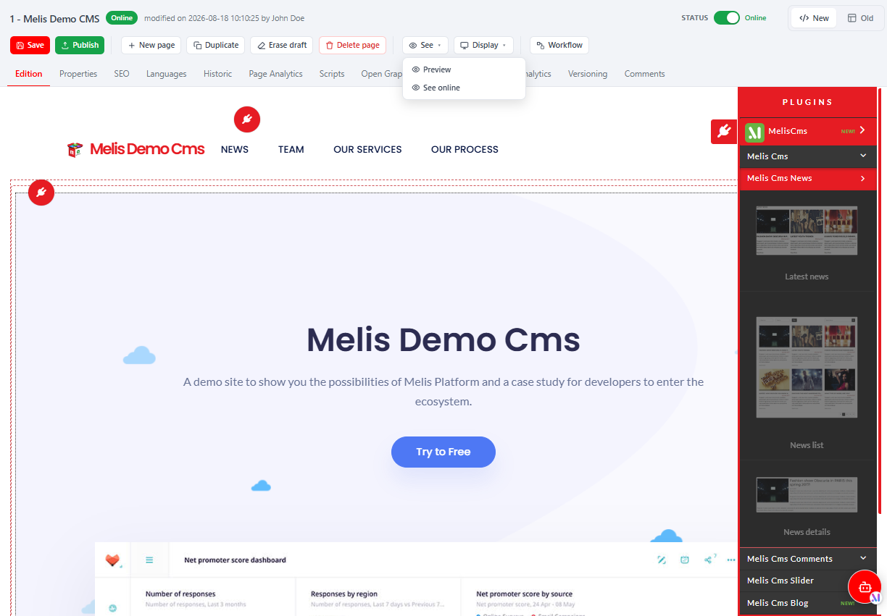
*The plugins panel — the content blocks you can drop onto the page (Melis Cms, News, Comments, Slider, Blog…). Which blocks appear depends on the site's active modules.*

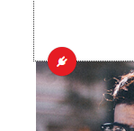
*A placed block's handle on the page — select it to edit, move, configure or delete.*

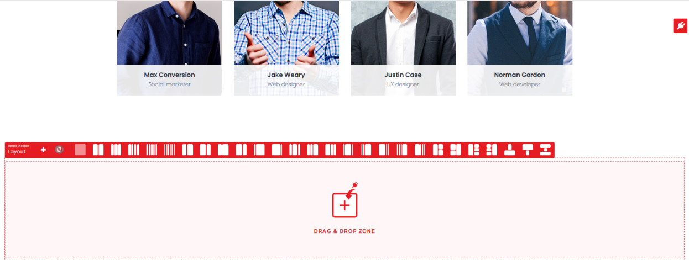
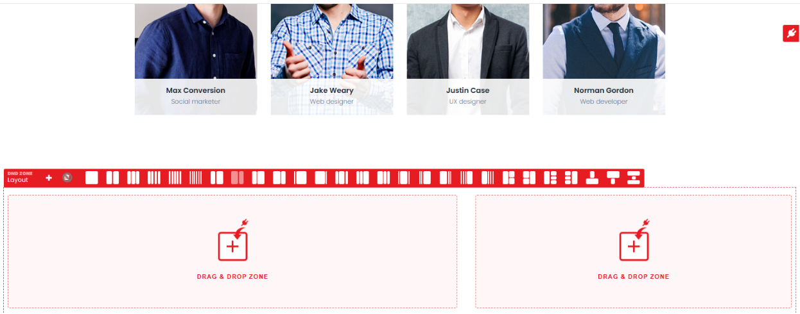
*Drag-drop zone layouts — choose how to split a zone to place your blocks.*

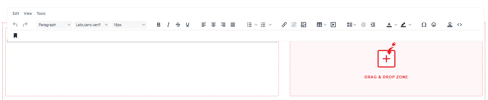
*An editable HTML block rendering its content directly on the page.*

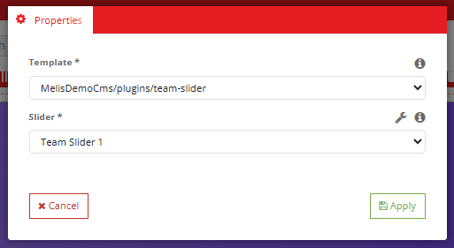
*A block's settings — e.g. picking which template/layout the block renders with.*

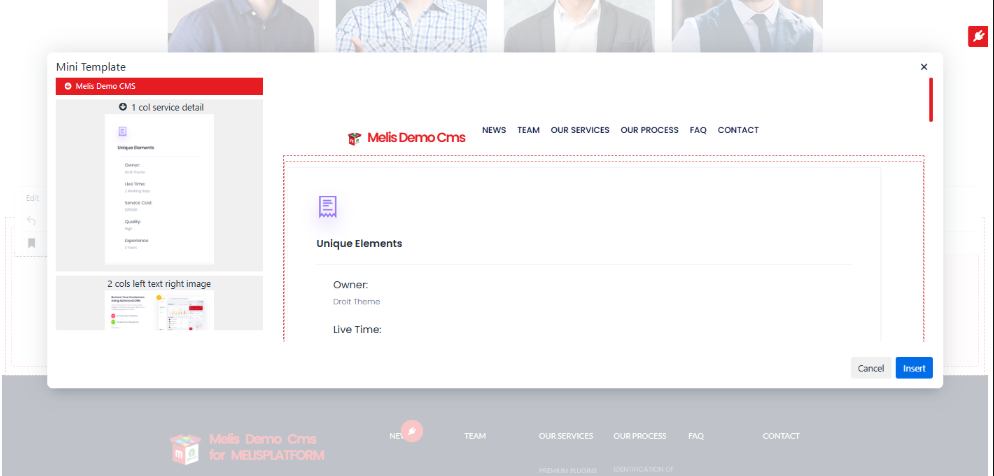
*Opening the mini-template manager to drop in a ready-made block.*

### A5.3 SEO tab (native React)

The page's friendly **URL**, **meta title/description**, canonical and redirect URLs.

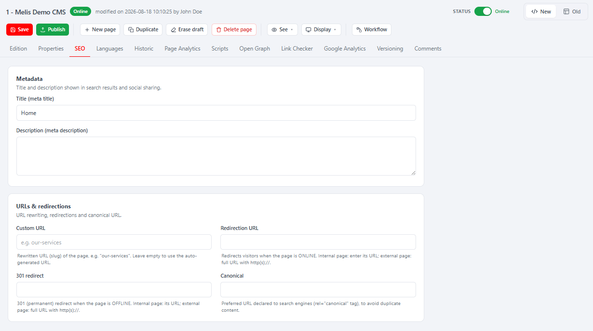
*The React SEO tab — URL, meta title/description and redirect fields.*

### A5.4 Languages tab (native React)

Create and manage **language versions** of the page (each with its own content and SEO).

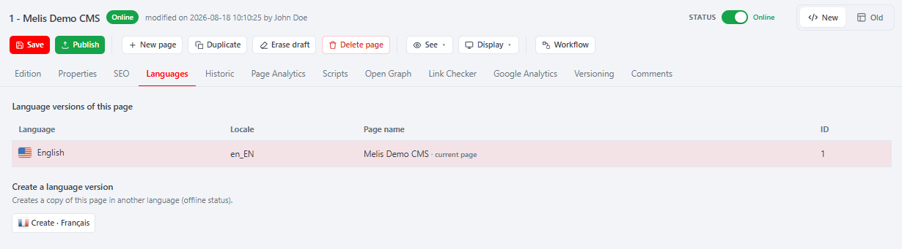
*The React Languages tab — the page's versions per language.*

### A5.5 Saving vs Publishing

- **Save** writes the draft (Properties + SEO + the drag-drop XML together, one action).
- **See → Preview / See online** shows the draft or the live page.
- **Publish** makes the current draft live; the **status switch** publishes / unpublishes.
- **Erase draft** discards the draft back to the published version.

> Rule of thumb: edit freely, **Save** as you go, **See → Preview** to check, then **Publish**.

---

## The side tools — explained

*Each side tool has its own sidebar entry under Site Tools, its own tree route, and a **New/Old**
toggle. They are **native full-React**.*

## A6. Sites tool — create and manage websites

**Where:** sidebar → **Site Tools → Sites** (route `/melis-cms/sites`).

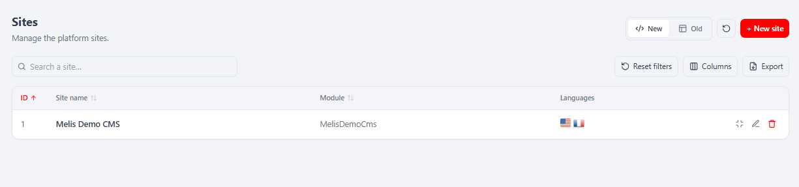
*The React Sites tool — search, Columns, Export, the New/Old toggle and "+ New site". Each row is a whole website (ID, name, module, languages) with edit/delete actions.*

### How do I create a new site?

Click **+ New site** and follow the **5-step wizard**: **Multilingual → Languages → Domains →
Module → Summary**.

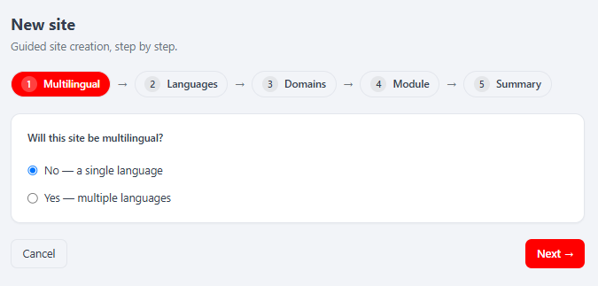
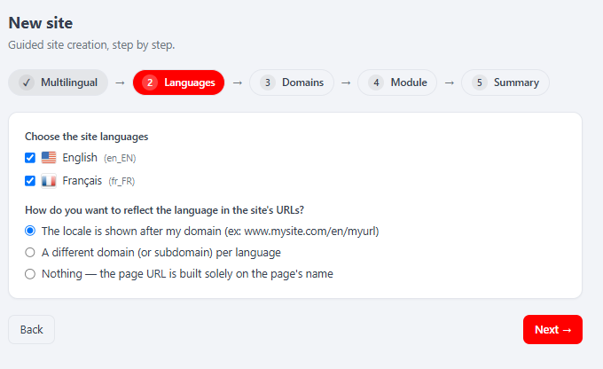
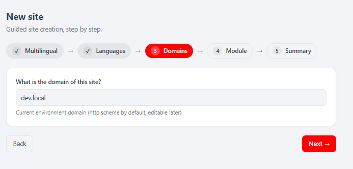
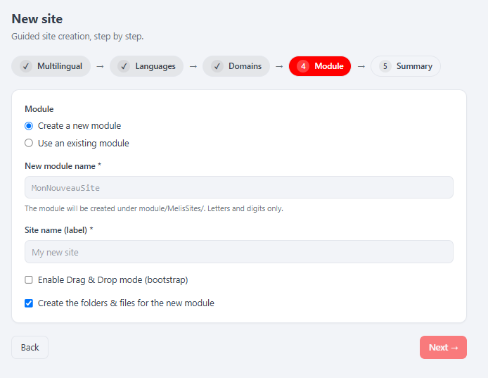
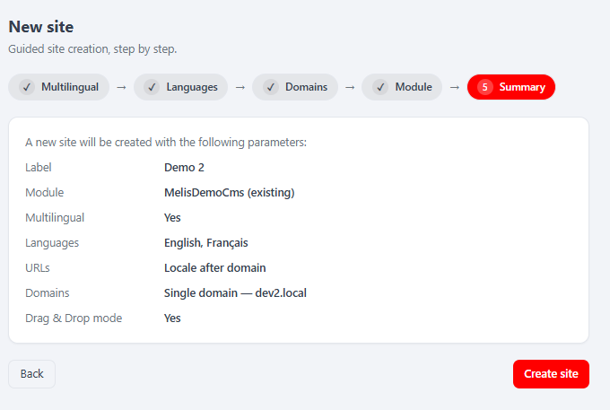
*The React new-site wizard, step by step — is it multilingual, which languages, which domain(s),
which module to base it on, then a summary that creates the site and its home page.*

### Managing an existing site — the edit tabs

Open a site to manage it through **native React tabs**: **Properties · Module Loading · Domains ·
Languages · Site Config · Translations · Scripts**.

- **Properties** — the site's name/label, home page and 404 page.
- **Module Loading** — the on/off switches (and load order) for features on this site.

  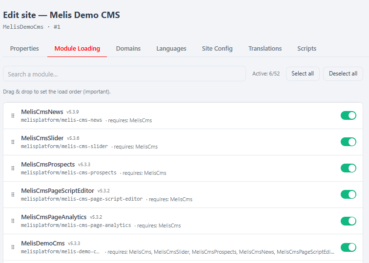
  *The React Module Loading tab — search, "Active N/M", Select all / Deselect all, drag-to-reorder the load order, per-module toggle with package/version/requires.*

- **Domains** — the web addresses the site answers on (per environment).

  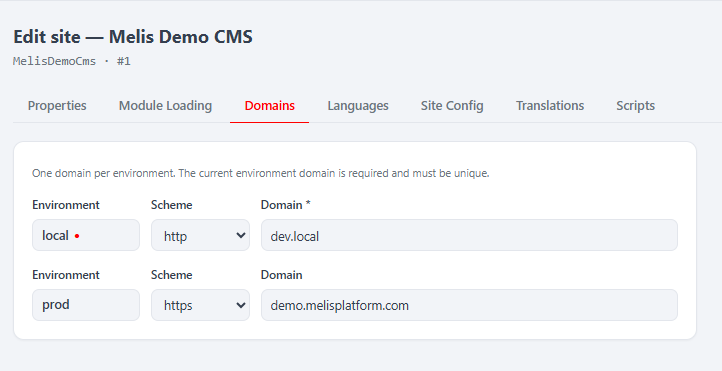

- **Languages** — which languages this site offers.

  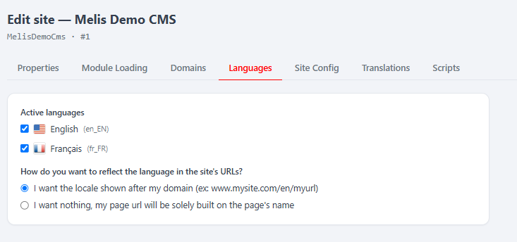

- **Site Config** — site-wide key/value settings, per language.

  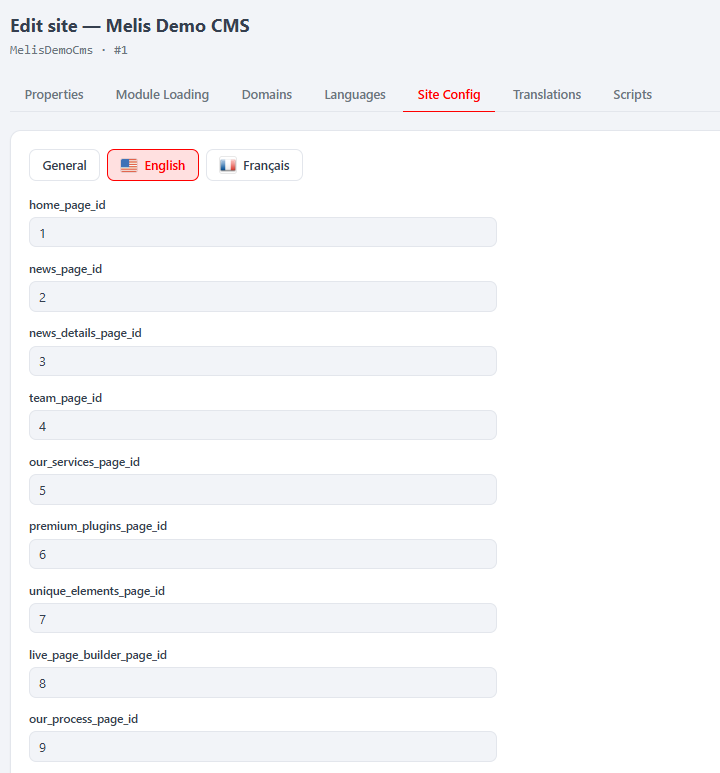
  *The React Site Config tab — General + per-language sub-tabs of key/value settings (home_page_id, news_page_id…).*

- **Translations** — the site's text strings, editable per language.

  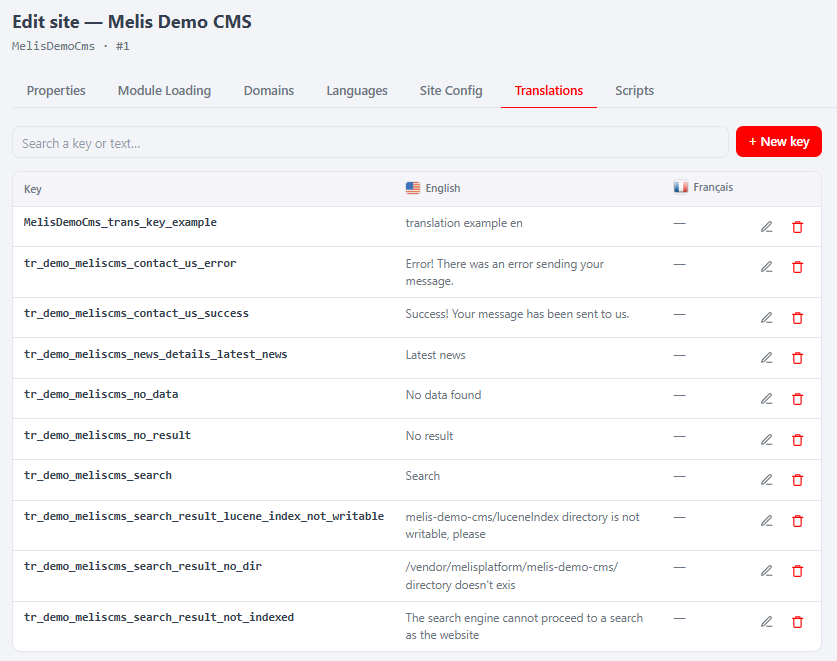
  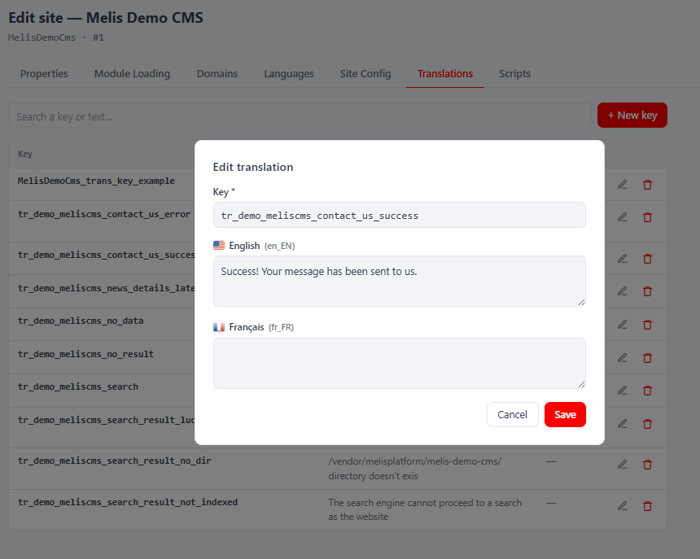
  *The React Translations tab — a searchable key table with a value per language, "+ New key", and a per-key edit modal.*

> **In short:** Properties/Domains/Languages define *what the site is and where it lives*; Module
> Loading turns *features* on; Site Config and Translations hold the *settings and wording*.

## A7. Templates tool — the page layouts

**Where:** sidebar → **Site Tools → Template manager** (route `/melis-cms/templates`).

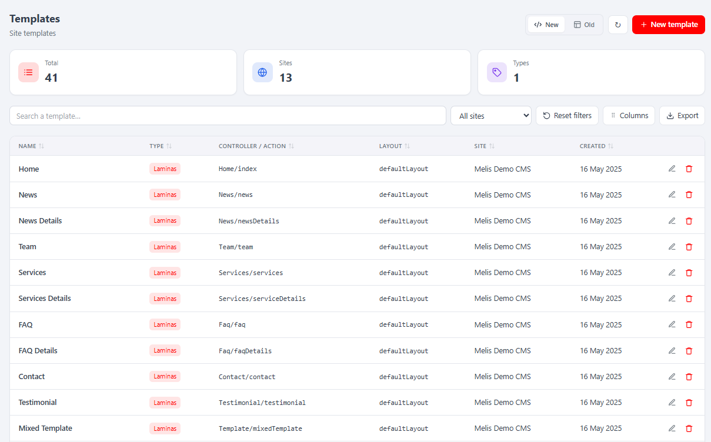
*The React Templates list — KPI cards (Total / Sites / Types), search, All-sites filter, Columns, Export, New/Old toggle, "+ New template". Rows show name, type, controller/action, layout, site, created.*

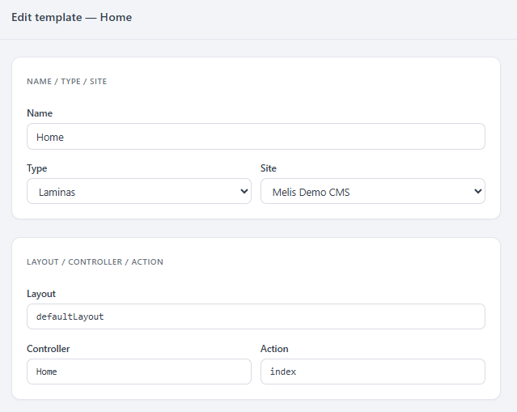
*The React template form — Name / Type / Site, and Layout / Controller / Action (the `.phtml` layout a template maps to). The New/Old toggle can show the classic Templates tool in an iframe instead.*

## A8. Styles tool — CSS applied to pages

**Where:** sidebar → **Site Tools → Styles** (route `/melis-cms/styles`).

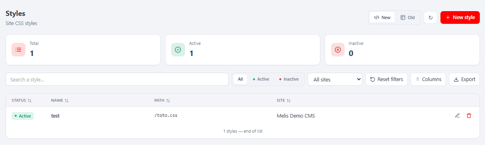
*The React Styles list — KPI cards (Total / Active / Inactive), search, status + site filters, Columns, Export, New/Old toggle, "+ New style". Each row: status, name, CSS path, site.*

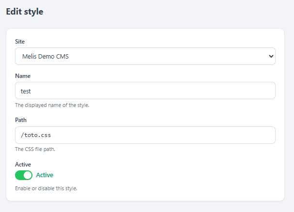
*The React style form — name, CSS path/source and site; then attach the style to a page from the page Properties tab (§A5.1).*

## A9. Front-office Languages tool — the languages the platform knows

**Where:** sidebar → **Site Tools → Languages** (route `/melis-cms/languages`).

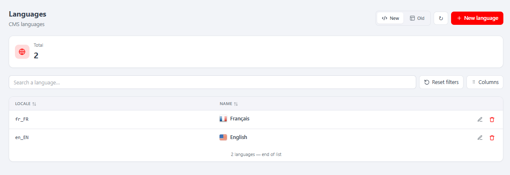
*The React Front-office Languages list — locale + name (with flag), New/Old toggle, "+ New language", per-row edit/delete.*

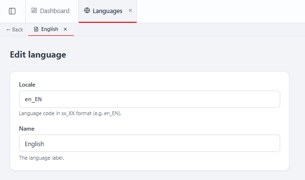
*Editing a language — its locale and name.*

## A10. Platforms IDs tool — page-id ranges per environment (advanced)

**Where:** sidebar → **Site Tools → Platforms IDs** (route `/melis-cms/platform-ids`).

Reserves a distinct band of page & template IDs per environment so IDs never collide when moving
content between dev / staging / production.

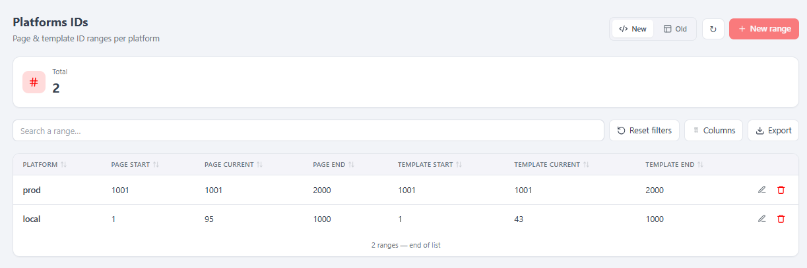
*The React Platforms IDs list — per platform: page start/current/end and template start/current/end, with Columns, Export, New/Old toggle, "+ New range".*

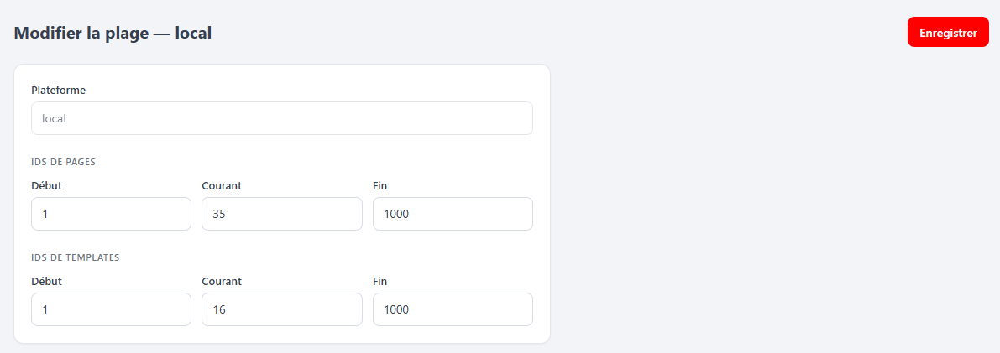
*Editing a platform's ID range.*

## A11. 301 Redirects tool — keep old links working

**Where:** sidebar → **Site Tools → Site redirect** (route `/melis-cms/site-301`).

When a public URL changes, add a redirect so the old address still resolves.

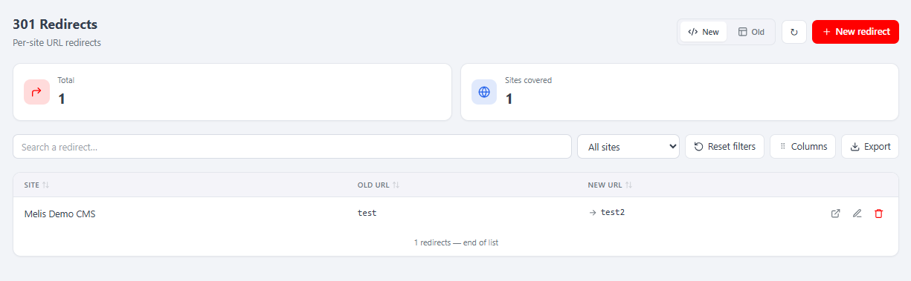
*The React 301 Redirects list — per site: old URL → new URL, with New/Old toggle and "+ New redirect".*

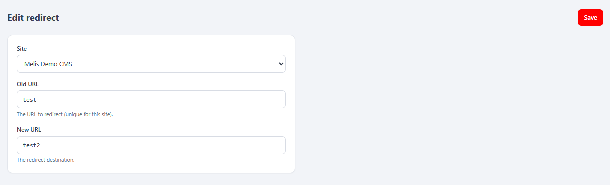
*The React redirect form — Site, Old URL (unique per site) and New URL (the destination).*

## A12. Mini-Templates & Menu manager — reusable, ready-made content

**Mini-Templates** (route `/melis-cms/mini-templates`) are pre-built content blocks editors can drop
onto a page in one click; the **Menu manager** (route `/melis-cms/menu-manager`) organises them into
categories so they're easy to find in the page editor's mini-template manager (§A5.2).

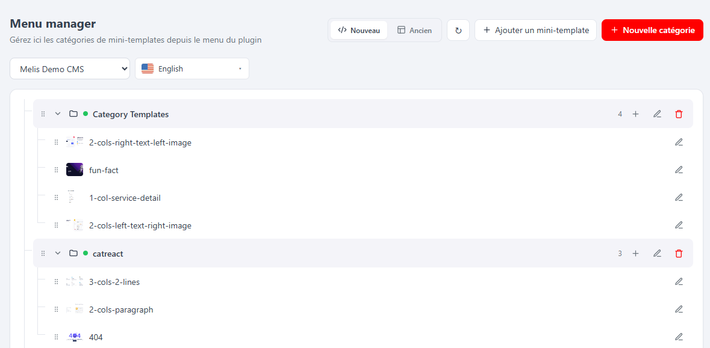
*The React Menu manager — pick a site + language, then a drag-reorderable tree of categories and their mini-templates; add categories/mini-templates, edit, delete. New/Old toggle top-right.*

## A13. Dashboard widget — Pages indicators

On the back-office **Dashboard**, MelisCms shows an **Indicators** widget.

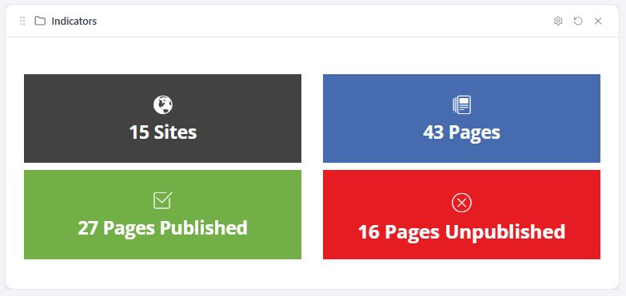
*The Indicators dashboard widget — a quick health view: number of sites, pages, pages published vs unpublished.*

## A14. Common tasks — "How do I…?"

- **Create a website** → Site Tools → **Sites** → **+ New site** → the 5-step wizard (§A6).
- **Create a page** → in the **page tree** (§A4), a node's actions → *add page*, set Properties, go
  to **Edition** to add content.
- **Add content** → open the page → **Edition** tab → open the plugins panel and **drag** a block
  into a zone, then click it to edit/configure (§A5.2).
- **A feature isn't showing on a site** → Sites → open the site → **Module Loading** → toggle it on.
- **Change a page's address** → page editor → **SEO** tab → edit the URL, then add a **301 Redirect**
  from the old URL (§A11).
- **Publish a page** → page editor → **Save** then **Publish** (§A5.5).
- **Make a page multilingual** → add the language (§A9), enable it on the site (§A6 → Languages),
  then use the page **Languages** tab (§A5.4).
- **Store a per-site setting** → Sites → **Site Config**; **change a site label/wording** → Sites →
  **Translations** (§A6).
- **Reuse a page structure** → tree → **Duplicate** (§A4).
- **Compare a tool's React vs classic view** → the tool's top-right **New / Old** toggle.

---
---

# PART B — Technical Reference

*MelisCms ships one multi-brick bundle. B1 = the manifest + registrations; B2 = the page-editor
internals (sidebar host, tree api, tabs, Edition iframe, modular seams); B3 = each tool's react-api;
B4 = capabilities; B5 = code map. Business logic stays server-side (Laminas services) — see
[MelisCms.md](./MelisCms.md).*

## B1. React presence at a glance — the multi-brick manifest

`public/ui-react/brick.manifest.json` has a top-level `entry: "brick.js"` and a `bricks: [...]`
array (verbatim ids/routes/keys):

```json
{ "entry": "brick.js", "bricks": [
  { "id": "cms",               "route": "/melis-cms/page",          "forwardKey": null,                           "melisKey": null,                                   "persistent": true },
  { "id": "cms-site-301",      "route": "/melis-cms/site-301",      "forwardKey": "MelisCms/SiteRedirect",        "melisKey": "meliscms_tool_site_301",               "subTabs": true },
  { "id": "cms-templates",     "route": "/melis-cms/templates",     "forwardKey": "MelisCms/ToolTemplate",        "melisKey": "meliscms_tool_templates",              "subTabs": true },
  { "id": "cms-languages",     "route": "/melis-cms/languages",     "forwardKey": "MelisCms/Language",            "melisKey": "meliscms_tool_language",               "subTabs": true },
  { "id": "cms-platform-ids",  "route": "/melis-cms/platform-ids",  "forwardKey": "MelisCms/Platform",            "melisKey": "meliscms_tool_platform_ids",           "subTabs": true },
  { "id": "cms-styles",        "route": "/melis-cms/styles",        "forwardKey": "MelisCms/ToolStyle",           "melisKey": "meliscms_tool_styles",                 "subTabs": true },
  { "id": "cms-sites",         "route": "/melis-cms/sites",         "forwardKey": "MelisCms/Sites",               "melisKey": "meliscms_tool_sites",                  "persistent": true, "subTabs": true },
  { "id": "cms-mini-templates","route": "/melis-cms/mini-templates","forwardKey": "MelisCms/MiniTemplateManager", "melisKey": "meliscms_mini_template_manager_tool",  "subTabs": true },
  { "id": "cms-menu-manager",  "route": "/melis-cms/menu-manager",  "forwardKey": "MelisCms/MiniTemplateMenuManager","melisKey": "meliscms_mini_template_menu_manager_tool","subTabs": true }
]}
```

`ui-react/src/brick.tsx` registers all nine ids (the host discovers them from the manifest and maps
each `forwardKey` → tree route via `useNavMenu`):

```tsx
window.__melisRegisterBrick?.({ id: 'cms', Component: CmsPage, Sidebar: CmsSidebar })  // page editor = SIDEBAR HOST
window.__melisRegisterBrick?.({ id: 'cms-site-301',      Component: SiteRedirectPage })
window.__melisRegisterBrick?.({ id: 'cms-templates',     Component: TemplatePage })
window.__melisRegisterBrick?.({ id: 'cms-languages',     Component: CmsLanguagePage })
window.__melisRegisterBrick?.({ id: 'cms-platform-ids',  Component: CmsPlatformIdPage })
window.__melisRegisterBrick?.({ id: 'cms-styles',        Component: CmsStylePage })
window.__melisRegisterBrick?.({ id: 'cms-sites',         Component: SitesPage })
window.__melisRegisterBrick?.({ id: 'cms-mini-templates',Component: MiniTemplatePage })
window.__melisRegisterBrick?.({ id: 'cms-menu-manager',  Component: MenuManagerPage })
```

Only `cms` passes a `Sidebar`. The bundle is a Vite **IIFE** with React externalised to the host
globals (`MelisReact*`) — so bricks use inline styles + in-file i18n and cannot import host modules.

## B2. The page editor internals (`cms` brick)

### B2.1 Sidebar host — the page tree

`CmsSidebar.tsx` → `PageTree.tsx` render the site page tree in the left sidebar; a click calls
`window.__melisOpenTab({ id:'/melis-cms/page/:id', label, path })` to open the page as a top tab.
The tree data reuses **legacy endpoints** (no backend change) via `cms-tree-api.ts`:

| Purpose | Endpoint |
|---|---|
| Children of a node (lazy) | `GET /melis/MelisCms/TreeSites/get-tree-pages-by-page-id?nodeId=<id>` (`-1` = site roots) |
| Search pages by name | `POST /melis/MelisCms/Page/searchTreePages` (body `value=`) → id-chains |
| Move / re-parent | `GET /melis/MelisCms/Page/movePage?idPage=&oldFatherIdPage=&newFatherIdPage=&newPositionIdPage=` |
| Duplicate a tree | `POST /melis/MelisCms/TreeSites/duplicateTreePage` |
| Delete a page | `GET /melis/MelisCms/Page/deletePage?idPage=<id>` |

The tree also listens for `melis:cms-tree-refresh` (with `detail.revealPageId`) to refresh + expand
after Save/Publish/Delete.

### B2.2 The tabbed editor (`CmsPage.tsx`)

`CmsPage` is a React shell over the legacy tool (one iframe for Edition, coupled to actions). Key
facts an AI must know:

- **Structure is server-merged.** `GET /cms-page/structure?idPage=<id>` returns `{ idPage, header,
  tabs[], buttons[] }`; the shell renders the native tab bar + action buttons from it, so **other
  modules can add tabs/buttons by merging config server-side**.
- **Native tab content** — `PageTabs.tsx` exports `PropertiesTab`, `SeoTab`, `LanguagesTab` (+
  `HistoricTab`, `AnalyticsTab`, `ScriptsTab`, `VersioningTab`, `CommentsTab` for modular tabs).
  Properties/SEO are **controlled** and loaded **once per page** (never refetched on tab switch, to
  avoid wiping unsaved edits). Their read API (via `PageTabs.apiGet/apiPost` → base
  `/melis/react-api/cms-page/…`): `properties`, `seo`, `refs`, `languages`, `ancestors`, `lock`.
- **Edition tab = iframe** — `toolSrc(id)` = `/melis/react-tool-page?key=meliscms_page&idPage=<id>`
  (creation: `key=meliscms_page_creation`). The shell hides the redundant legacy chrome inside the
  iframe with injected CSS, and polls the nested canvas (`iframe.melis-iframe`) until it is
  `complete` before enabling Save/Publish.
- **One global Save/Publish** — the top buttons post to the **legacy** endpoints with the exact
  legacy field names (from `app.forms.php`): `POST /melis/MelisCms/Page/savePage?idPage=` and
  `.../publishPage?idPage=` (body carries Properties + SEO; the Edition XML is read from the PHP
  session). Also `.../unpublishPage`, `.../clearSavedPage`, `.../deletePage`. See memory
  *cms-page-save-publish-wiring*.

### B2.3 Modular tab / save seams (the extension points)

Other modules contribute tabs and cross-tab saves **without touching MelisCms**:

```ts
// Register a page-edit tab (link-check, share/Open Graph, GA, page-historic, script-editor…)
window.__melisRegisterPageTab(key, ({ idPage }) => <MyTab idPage={idPage}/>)
// Register a cross-cutting save hook (run by the global Save/Publish, no per-tab button)
window.__melisRegisterPageSaveHook(key, async (idPage) => { /* persist my tab */ })
```

The shell's `SELF_TABS` maps known keys to components (`meliscms_page_languages`,
`melispagehistoric_historic`, `meliscms_page_analytics_tab`, `meliscms_page_script_editor`,
`melissb_page_versioning`, `melissb_page_comments`). A tab's **button** must also be declared under
the shared `meliscms_page` capability key (see §B4) or the caps whitelist hides it — memory
*cms-page-editor-modular-tab*. Modular buttons/modals seen: **Workflow** (melis-small-business) and
**newsletter** (melis-newsletter), both mutualised via `window.__melis…` bridges.

## B3. React API — endpoints (per tool)

Routes are declared in **`config/react-api.php`** (merged via `MelisCms\Module::getConfig()`) under
`/melis/react-api/…`; controllers are in `src/Controller/MelisReactApi*Controller.php`. Every
controller `use MelisReactApi\Controller\CapabilityGuardTrait` and guards each action with:

```php
if ($deny    = $this->denyUnlessAccess())        { return $deny; }    // 401 unauth / 403 MelisCoreRights::canAccess(MELIS_KEY)
if ($denyCap = $this->denyUnlessCan('list'))     { return $denyCap; } // capability (default-allow if undeclared)
```

Contract everywhere: `{ success, data }` on OK, `{ success:false, error }` on failure; every fetch
sends `X-Requested-With: XMLHttpRequest` + credentials.

### B3.1 `MelisReactApiPageController` — guard `meliscms_page` (page editor)
Base `/melis/react-api/cms-page`. Actions: `structure` (access-only), `properties`/`seo`/`refs`/
`languages`/`ancestors` (access-only, read), `save-properties` & `save-seo` (`edit`). Feeds the
`cms` brick's native chrome + Properties/SEO/Languages tabs (Edition/Save/Publish go through the
legacy `/melis/MelisCms/Page/*` endpoints, §B2.2).

### B3.2 `MelisReactApiCmsSitesController` — guard `meliscms_tool_sites`
Base `/melis/react-api/cms-sites`. Actions: `list` (`list`), `meta` (`list`; languages/modules for
the wizard, at `/cms-sites/meta`), `get` (`list`, at `/cms-sites/:id`), `config` (`list`, at
`/cms-sites/:id/config`), `modules` (`list`, at `/cms-sites/:id/modules`), `create` (`create`, at
`/cms-sites/create`; the wizard). Services: `MelisEngineTableSite`, `MelisEngineTableCmsSiteLangs`,
`MelisEngineTableSite404`, `MelisEngineLang`, `MelisCmsSiteService`. The site **edit tabs** reuse
legacy endpoints where native React isn't wired (Domains/Languages/Translations via legacy tabs
+ `site-tab-registry` for modular tabs).

### B3.3 `MelisReactApiSiteRedirectController` — guard `meliscms_tool_site_301`
Base `/melis/react-api/site-redirects`. Actions: `list` (`list`), `stats` (`list`), `sites`
(`list`), `get` (`edit`, at `/:id`), `save` (`create`|`edit`, at `/save`), `delete` (`delete`, at
`/delete/:id`).

### B3.4 `MelisReactApiTemplateController` — guard `meliscms_tool_templates`
Base `/melis/react-api/templates`. Actions: `list` (`list`), `stats` (`list`), `sites` (`list`),
`get` (`edit`, at `/:id`), `save` (`create`|`edit`, at `/save`), `delete` (`delete`, at
`/delete/:id`). Native list **and** native form (`TemplateForm`); the New/Old toggle's *Old* view is
the legacy tool in an iframe (`/melis/react-tool-page?key=meliscms_tool_templates`).

### B3.5 `MelisReactApiCmsLanguageController` — guard `meliscms_tool_language`
Base `/melis/react-api/cms-languages`. Actions: `list` (`list`), `stats` (`list`), `get` (`edit`),
`save` (`create`|`edit`), `delete` (`delete`).

### B3.6 `MelisReactApiCmsPlatformIdController` — guard `meliscms_tool_platform_ids`
Base `/melis/react-api/cms-platform-ids`. Actions: `list` (`list`), `stats` (`list`), `get`
(`edit`), `save` (`create`|`edit`), `delete` (`delete`).

### B3.7 `MelisReactApiCmsStyleController` — guard `meliscms_tool_styles`
Base `/melis/react-api/cms-styles`. Actions: `list` (`list`), `stats` (`list`), `sites` (`list`),
`get` (`edit`), `save` (`create`|`edit`), `delete` (`delete`).

### B3.8 `MelisReactApiCmsMiniTemplateController` — guard `meliscms_mini_template_manager_tool`
Base `/melis/react-api/cms-mini-templates`. Composite key (site_module + template_name), so `item`
and `delete` use query/body, not a numeric `:id`. Actions: `list` (`list`), `stats` (`list`),
`sites` (`list`), `item` (`edit`, at `/item`), `save` (`create`|`edit`, at `/save`), `delete`
(`delete`, at `/delete`).

### B3.9 `MelisReactApiCmsMenuManagerController` — guard `meliscms_mini_template_menu_manager_tool`
Base `/melis/react-api/menu-manager`. Reuses `MelisCmsMiniTemplateService` (getTree/saveTree/
saveCategory/deleteCategory). Actions: `sites` (`list`), `languages` (`list`), `tree` (`list`, at
`/tree`), `saveTree` (`edit`, at `/tree/save`), `category` (`edit`, at `/category/:id`),
`saveCategory` (`create`|`edit`, at `/category/save`), `deleteCategory` (`delete`, at
`/category/delete/:id`).

Example (a native list + save):

```ts
// GET the styles list (keyset)
const r = await fetch('/melis/react-api/cms-styles?limit=25', {
  headers: { 'X-Requested-With': 'XMLHttpRequest' }, credentials: 'include',
})
const { success, data } = await r.json()   // { success, data: { items, total, nextCursor } }

// POST save a 301 redirect
await fetch('/melis/react-api/site-redirects/save', {
  method: 'POST',
  headers: { 'X-Requested-With': 'XMLHttpRequest', 'Content-Type': 'application/json' },
  credentials: 'include',
  body: JSON.stringify({ id: null, siteId: 1, oldUrl: 'old', newUrl: 'new' }),
})
```

## B4. Capabilities (advanced rights)

Declared in **`config/react.capabilities.php`** under `melisReactToolCapabilities`, keyed by each
tool's **rights-bearing `melisKey`** (verbatim; `export` only where the tool has an Export button):

```php
'meliscms_tool_site_301'                    => ['list','create','edit','delete','export','test'],
'meliscms_tool_templates'                   => ['list','create','edit','delete','export'],
'meliscms_tool_styles'                      => ['list','create','edit','delete','export'],
'meliscms_tool_language'                    => ['list','create','edit','delete'],  // no export
'meliscms_tool_platform_ids'                => ['list','create','edit','delete','export'],
'meliscms_tool_sites'                       => ['list','create','edit','delete','export'],
'meliscms_mini_template_manager_tool'       => ['list','create','edit','delete','export'],
'meliscms_mini_template_menu_manager_tool'  => ['list','create','edit','delete'],  // no export (tree)
```

The **page editor** is keyed under `meliscms_page` as a **structured tree** (actions + tabs), so
its buttons and tabs each become a capability:

```php
'meliscms_page' => [
  'actions' => ['create','save','clear','publish','status','delete','duplicate','view','display'],
  'tabs'    => ['edition','properties','seo','languages'],  // flattened keys
],
```

MODULARITY: **each contributing module adds ITS tabs/buttons under this SAME `meliscms_page` key**
in its own `react.capabilities.php` (Laminas merge) — e.g. melis-small-business declares workflow /
versioning / comments; page-historic/analytics/script-editor declare theirs. `CmsPage.tsx` filters
tabs and hides refused buttons via `useCaps('meliscms_page').can(cap)`.

Two more keys in this file (read by `MelisReactApi\…\buildMenuResponse`):
- `melisReactRightsTools['meliscms_toolstree_section']` — injects a **rights-only** node
  `meliscms_page` ("Page edition") into **Users → Rights** (not the left menu; the editor opens via
  the site tree's per-page rights).
- `melisReactSidebarHostSections['meliscms_toolstree_section']` — `{ requires:'meliscms_page',
  module:'MelisCms' }` keeps the MelisCms section visible (to hang the page tree) whenever the user
  can access the page editor, even with no site-tool.

## B5. Quick code map

```
melis-cms/
├── config/
│   ├── react-api.php               native react-api routes (/melis/react-api/…) + 9 invokable controllers
│   └── react.capabilities.php      melisReactToolCapabilities (8 tools + meliscms_page tree)
│                                    + melisReactRightsTools + melisReactSidebarHostSections
├── src/Controller/
│   ├── MelisReactApiPageController.php          meliscms_page (structure/properties/seo/refs/languages/ancestors)
│   ├── MelisReactApiCmsSitesController.php       meliscms_tool_sites (list/meta/get/config/modules/create)
│   ├── MelisReactApiSiteRedirectController.php   meliscms_tool_site_301
│   ├── MelisReactApiTemplateController.php       meliscms_tool_templates
│   ├── MelisReactApiCmsLanguageController.php    meliscms_tool_language
│   ├── MelisReactApiCmsPlatformIdController.php  meliscms_tool_platform_ids
│   ├── MelisReactApiCmsStyleController.php       meliscms_tool_styles
│   ├── MelisReactApiCmsMiniTemplateController.php   meliscms_mini_template_manager_tool
│   ├── MelisReactApiCmsMenuManagerController.php    meliscms_mini_template_menu_manager_tool
│   └── React/PluginViewToolPageExtension.php     (tool-page rendering extension)
├── ui-react/                        Vite IIFE brick (React external) → ../public/ui-react/brick.js
│   └── src/
│       ├── brick.tsx                registers 9 ids (cms = Component + Sidebar)
│       ├── CmsPage.tsx · CmsSidebar.tsx · PageTree.tsx · PageTabs.tsx   page editor (host)
│       ├── NewPageView.tsx · DuplicatePageModal.tsx · PagePicker.tsx · cms-tree-api.ts
│       ├── SitesPage.tsx · SitesList.tsx · SiteEditor.tsx · SiteWizard.tsx
│       ├── site-tab-registry.ts · site-tabs/{ConfigTab,ModuleLoaderTab,TranslationsTab}.tsx · sites-api.ts
│       ├── SiteRedirectPage.tsx · redirect-api.ts   · TemplatePage.tsx · template-api.ts
│       ├── CmsLanguagePage.tsx · cms-language-api.ts · CmsPlatformIdPage.tsx · cms-platform-id-api.ts
│       ├── CmsStylePage.tsx · cms-style-api.ts · MiniTemplatePage.tsx · mini-template-api.ts
│       ├── MenuManagerPage.tsx · menu-manager-api.ts · ViewToggle.tsx · use-keyset-list.ts
│       ├── page-editor-i18n.ts · legacy-errors.ts · site-errors.ts
│       └── shared/{ExpandableRow,melis-form-errors,use-drag-reorder,useIsNarrow}
└── public/ui-react/                brick.js (built) + brick.manifest.json (bricks: [...] × 9)
```

> Business logic stays server-side (Laminas services); React = presentation + API calls. Data model,
> services, page-lifecycle events and the plugin framework (owned by MelisEngine, rendered by
> MelisFront): [MelisCms.md](./MelisCms.md).

---

## Screenshot index

Filename → content lookup for the MelisAI MCP. All under `./images/react/`.

| Image file | Content |
|---|---|
| `meliscms-menu-entry.png` | MelisCms React sidebar — PAGE TREE panel + Site Tools group |
| `meliscms-menu-site-treeview.png` | React page tree (sites & pages) |
| `meliscms-menu-site-treeview-actions.png` | Page node actions in the React tree |
| `meliscms-menu-site-treeview-actions-duplicate-tree.png` | Duplicate page/tree modal |
| `meliscms-page-menu-see-details.png` | Page — "See" (Preview / See online) menu |
| `meliscms-page-menu-display-details.png` | Page — details / Display menu |
| `meliscms-page-tab-properties.png` | Page editor — Properties tab (native React) |
| `meliscms-page-tab-edition.png` | Page editor — Edition tab (legacy drag-drop in an iframe) |
| `meliscms-page-tab-edition-menu-templating-plugins.png` | Edition — plugins panel |
| `meliscms-page-tab-edition-icon-plugin.png` | Edition — a placed block's handle on the page |
| `meliscms-page-tab-edition-dragdropzone-layouts.png` | Edition — drag-drop zone layouts |
| `meliscms-page-tab-edition-dragdropzone-layouts-2.png` | Edition — drag-drop zone layouts (more) |
| `meliscms-page-tab-edition-plugin-html-rendering.png` | Edition — HTML plugin rendering on the page |
| `meliscms-page-tab-edition-plugin-config-template-selection.png` | Edition — plugin config: template selection |
| `meliscms-page-tab-edition-minitemplatemanager-from-htmlplugin.png` | Edition — mini-template manager from an HTML plugin |
| `meliscms-page-tab-seo.png` | Page editor — SEO tab (native React) |
| `meliscms-page-tab-languages.png` | Page editor — Languages tab (native React) |
| `meliscms-tool-sites-list.png` | Sites tool — list (New/Old, Export, + New site) |
| `meliscms-tool-sites-newsite-modal-step1.png` | New-site wizard — step 1 (Multilingual) |
| `meliscms-tool-sites-newsite-modal-step2.png` | New-site wizard — step 2 (Languages) |
| `meliscms-tool-sites-newsite-modal-step3.png` | New-site wizard — step 3 (Domains) |
| `meliscms-tool-sites-newsite-modal-step4.png` | New-site wizard — step 4 (Module) |
| `meliscms-tool-sites-newsite-modal-step5.png` | New-site wizard — step 5 (Summary) |
| `meliscms-tool-sites-edit-tab-moduleloading.png` | Site edit — Module Loading tab (toggles + load order) |
| `meliscms-tool-sites-edit-tab-domains.png` | Site edit — Domains tab |
| `meliscms-tool-sites-edit-tab-languages.png` | Site edit — Languages tab |
| `meliscms-tool-sites-edit-tab-siteconfig.png` | Site edit — Site Config tab (per-language key/values) |
| `meliscms-tool-sites-edit-tab-translations.png` | Site edit — Translations tab (key table per language) |
| `meliscms-tool-sites-edit-tab-translations-edit.png` | Site edit — edit a translation key |
| `meliscms-tool-templatemanager-list.png` | Templates — list (KPI cards, controller/action, site) |
| `meliscms-tool-templatemanager-edit.png` | Templates — native form (name/type/site, layout/controller/action) |
| `meliscms-tool-stylemanager-list.png` | Styles — list (status/name/path/site) |
| `meliscms-tool-stylemanager-edit.png` | Styles — style form (name, CSS path, site) |
| `meliscms-tool-languages-frontoffice-list.png` | Front-office Languages — list (locale/name) |
| `meliscms-tool-languages-frontoffice-edit.png` | Front-office Languages — edit a language |
| `meliscms-tool-platformids-list.png` | Platforms IDs — list (page/template ID ranges per platform) |
| `meliscms-tool-platformids-edit.png` | Platforms IDs — edit a range |
| `meliscms-tool-siteredirect-list.png` | 301 Redirects — list (old URL → new URL per site) |
| `meliscms-tool-siteredirect-edit.png` | 301 Redirects — redirect form (site, old/new URL) |
| `meliscms-tool-minitemplate-menu-manager.png` | Menu manager — category tree of mini-templates (site + language) |
| `meliscms-dashboardplugins-indicators.png` | Indicators dashboard widget — sites/pages published/unpublished |

---

*Document for AI consumption (MelisAI MCP) — React back-office of `melisplatform/melis-cms`: the CMS
page-editor sidebar host + 8 native React side tools, in one multi-brick bundle. Part A = functional
guide for users; Part B = technical reference with examples for developers/AI. Legacy tool doc:
[./MelisCms.md](./MelisCms.md). Last reviewed 2026-08-19.*
